# Python-Project.py

## Statistical Analysis of the Iris Dataset

### Evolution of Machine Learning

## Introduction
 The most famous set of data for data mining and machine learning is the infamous Iris data set. 
 The Iris Data Set is a specific set of information compiled by Ronald Fisher. Ronald Fisher as a biologist in the 1930’s.

 But the original data was taken by a man named Edgar Anderson in 1935 who was an American botanist who studied the flowers in Quebec in Canada, he called the data “The irises of the Gaspe Peninsula, he did this to quantify the variation of iris flowers. Two of the the three species were collected in the Gaspe Peninsula and were picked on the same day from the same field and measured at the same time by the same time with the same aparatus.
 

### Ronald Fisher used the data as an example for multivariante discriminant analysis.
The Iris Data Set describes biological characteristics of various types of flowers, specifically length and width of both petals and sepals which are part of the flowers reproductive system.
The data set contains 3 classes of 50 instances each, where each class refers to a type pf Iris plant. One class is linearly separable from the other to and the latter are not linearly separable from each other.

## Attribute Information:
1.	Sepal Length in cm
2.	Sepal Width in cm
3.	Petal Length in cm
4.	Petal Width in cm

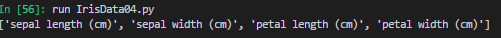

# Picture of Iris Versicolor

# Picture of Setosa

# Picture of Iris Virginica

## Class:
1.	Iris Versicolor
2.	Iris Setosa
3.	Iris Virginica
 .
It is used widely as a data set for testing purposes in computer science. Also, many academic researchers have used the Iris Data Set in the area of machine learning, as the dat is about pattern recognition, researchers believe that the computer has the capacity to learn without being programmed to perform specific tasks.

There is a lot of research in the area of Artificial Intellignece and researchers are interested to see can computers learn form data. Machines can use previous computations to automate to repeat and automate future deciosn making.This has been aroung for quiet a while but now with the ever growing scale of data and its now affordable data storage, and the need for automatuion and efficiency and effectiveness in the workplace and beyond, we need to find a way to analyze large ammounts of more complex data and deliver faster results.
Machine learning can range at present form online reccommendations on Amazon or Netflix to Googles self drive cars, to fraud detection.

 In this Project i will use the Python script to analyse various data to find out more about the infamous Iris Data Set and use charts and tables to show the results of my findings. I will also use various libraries and websites to to aid me in this project and further my knowledge and understanding of this particular data set.

 Python is an interpreted, object orientated programming language that is very popular due to its clear syntax and readibility. Python was created by Guido van Rossum from the Netherlands, whose favourite comedy act ws monty pythons flying circus. I will be using Virtual studio which is a code editor and also i will be importing many different libraried to help me in this assignment.
 I have also used ipython which is an interactive shell built with python. I have stored all the python scripts required to run this analysis in the folder the iris datset with comments to explain why i used that particular data.

 I want to see how the three classes of the Iris dataset differ and in what way.First we will look at what is the minimum and maximum of each of the four columns of the iris data set.

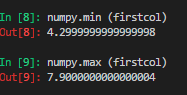

 We can see from the above data results taken of the first column of the Iris Data set that the minimum is 4.29 and the maximum is 7.9. 
Result output for column 2: Minimum was 2.0 and the maximum was 4.4.
Result output for column 3: Minimum was 1.0 and Maximum was 6.9.
Result output for column 4: Minimum was 0.1 and Maximum was 2.5.

 To get a better more accurate picture of this data set we will calculate the average of the Iris Data set.

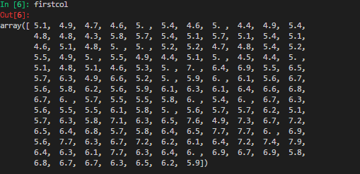
					
					
	
	
										

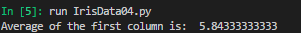
					
					
 We can see from this array of data that the average of the first column is 5.84
					
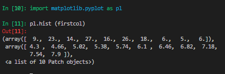

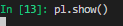

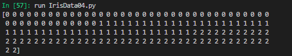
In this data we have printed out the integers that represent the species of each observation

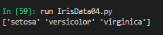
 These are the names of the Iris flowers

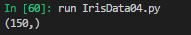
 The quantity of data in this dataset

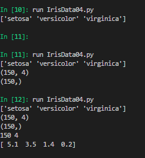
 The name of the flowers and the number of rows and columns together in one script.

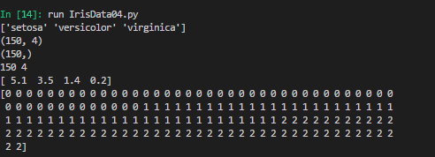
 The values ranging from 0 to 2 from the three classes

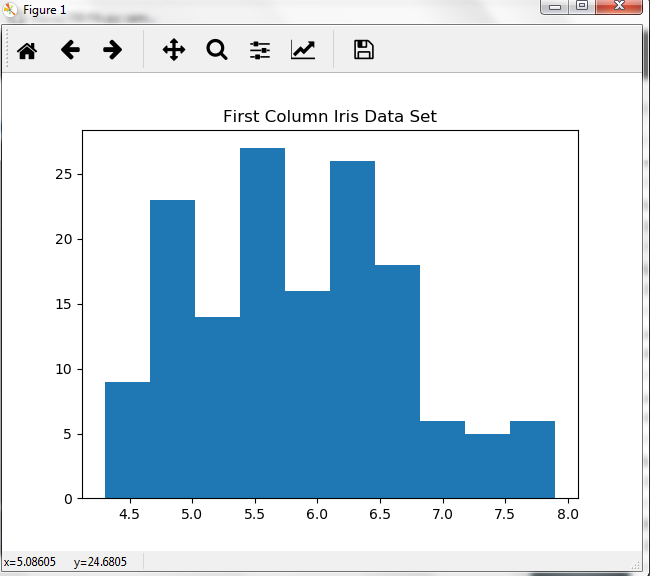

 The above histogram shows data from the first column of the Iris datset. On the X axis which is the width we have an average of 5.08605 and on the Y axis we have an average of 24.6805.
 
 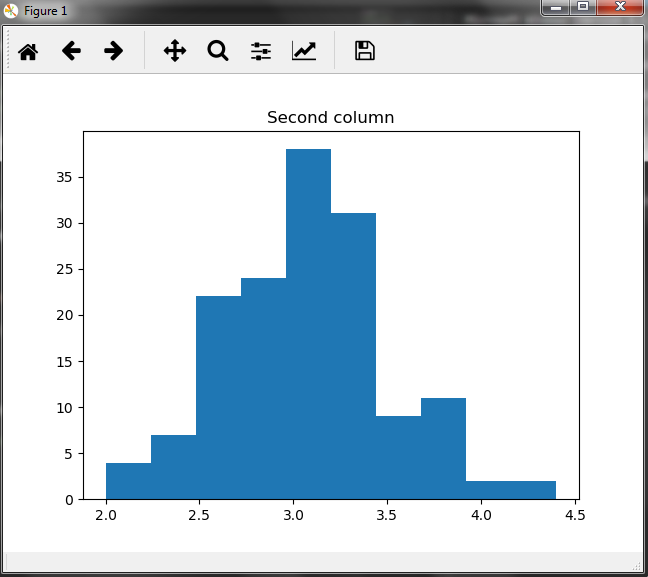

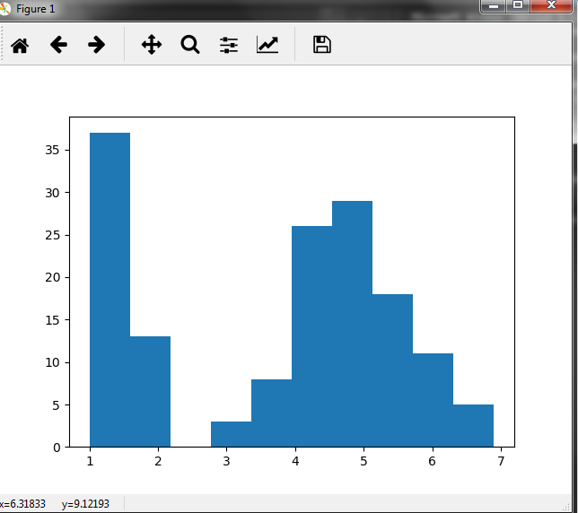

 Instead of writing individual scripts to analyse each column of the Iris data set separately i have used a Python script to run various data in one go to get a greater understanding of this particular data set below you can see we have calculated the standard deviation, the mean, minimum and maximum and also the top 25%,50% and 75% of the data, and alos the top 5 lines and the bottom five lines of the Iris data set.
This is a sample of the data used to achieve this result.
dataset.head()
dataset.tail()
dataset.descibe()
To get this data to run i used varous libraries such as sklearn, pandas and matplotlib.pyplot. 

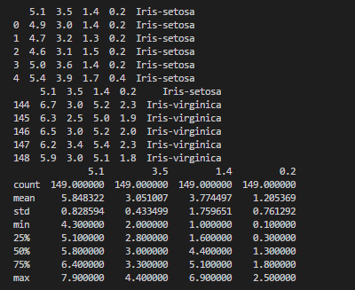

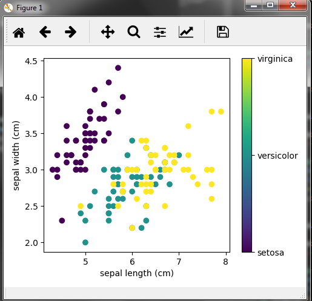

The above scatterplot plots the Iris data in both sepal length and sepal width. 
First we will look the length,1: Iris Viriginica has the longest sepals
				      2: Iris Versicolor has the medium lenght sepals
				      3: Iris Setosa has the shortest length sepals 
compared to all the other classes.

Secondly we will look at the width, 1: Iris Setosa has the widest sepals
				    2: Iris Virginica has the mdium width sepals
				    3: Iris Versicolor has the narrowest sepals
compared to all the other classes.
				    

Below you will see a python script that finds out what kind of Iris measures 3cm x 5cm sepal and 4cm x 2cm petal? 

from sklearn import neighbors, datasets
iris = datasets.load_iris()
x,y = iris.data, iris.target
knn = neighbors.KNeighborsClassifier(
    n_neighbors=1)
knn.fit(x,y)
    # what kind of iris has 3cm x 5cm sepal and 4cm x 2cm petal?
print(iris.target_names[knn.predict([[3,5,4,2]])])

 ### Result seen here is that the Virginica measures 3cm x 5cm sepal and 4cm x 2cm petal.
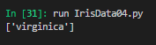

References

https://www.techopedia.com/definition/32880/iris-flower-data-set
https://archive.ics.uci.edu/ml/machine-learning-databases/iris/iris.names
https://analyticsindiamag.com/start-building-first-machine-learning-project-famous-dataset/
https://www.kaggle.com/uciml/iris
https://rstudio-pubs-static.s3.amazonaws.com/205883_b658730c12d14aa6996fe2f6c612c65f.html
http://www.codeastar.com/beginner-data-science-tutorial/
https://www.kaggle.com/uciml/irisIris_flower_data_set
https://en.wikipedia.org/wiki/Iris_flower_data_set
https://www.sas.com/en_ie/insights/analytics/machine-learning.html

	

	
	
	
	
	
	
	
	
	
	
	
	
	
	
	
	
	
	
	
	
	
	
	
	
	
	
	
	
	
	
	
	
	
	
	
	
	
	
	
	
	

 

